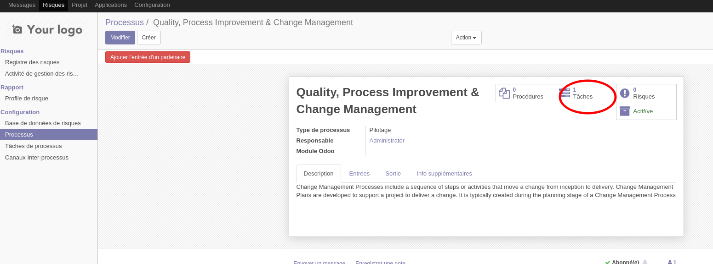
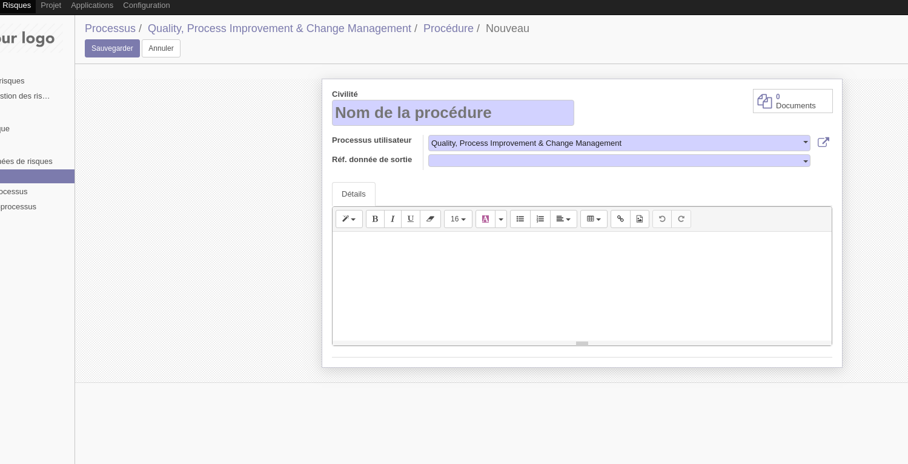
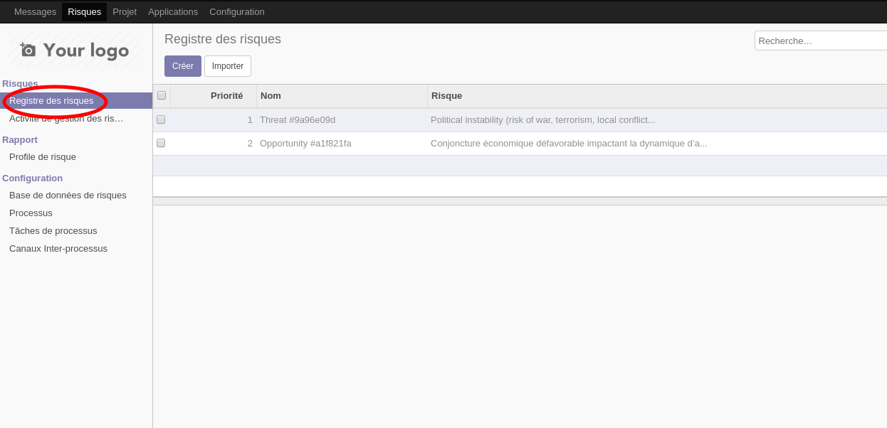
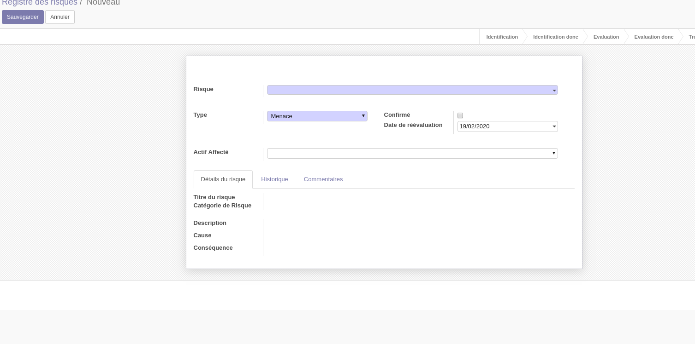
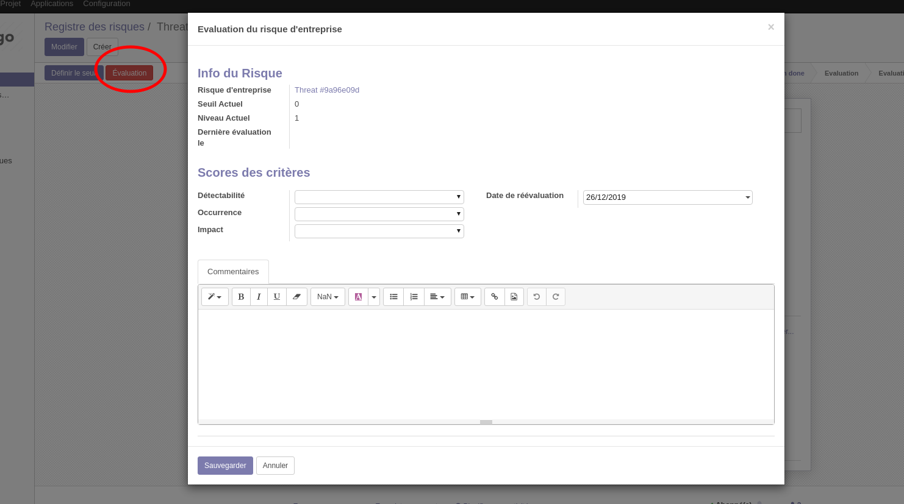

.. _user_documentation:

========================
Module `Risk Management`
========================

------------------------------
Documentation de l'utilisateur
------------------------------

Introduction
============

Le module `Risk Management` est un module **Odoo** conçu pour faciliter la gestion des risques au sein de l'entreprise. Il permet d'enregistrer les risques et de suivre l'évaluation et, eventuellement, le traitement de ceux-ci.

L'approche de la gestion du risque adoptée dans la conception du module `Risk Management` va dans le sens de la norme ISO 9001:2015 qui voit la gestion du risque "comme un outil de l'amélioration continue". Pour se faire la gestion des risques se base par défaut sur une cartographie des processus de l'entreprise; ceci donne la possibilité de rattacher chaque risque à un de ces  processus.

Fonctionnalités de l'application
================================
Les fonctionnalités du module `Risk Management` peuvent être regroupées sous 2 catégories:

#. La première et principale catégorie, celle de la gestion des risques, comprend les fonctionnalités suivantes:
    - le signalement des risques par les utilisateurs (en principes les employés de l'entreprise);
    - la notation des risques sur les critères de "détectabilité", de "probabilité d'occurrence" et de "sévérite";
    - le classement des risques par ordre de priorité, c'est à dire en fonction des scores de leur évaluation;
    - le suivi des activités de traitement des risques.
#. La seconde catégorie, celle de la modélisation des processus, est subsidiaire et implémente de façon simplifiée l'`approche processus`. Elle comprend les fonctionnalités suivantes:
    - la description des processus de l'entreprise ainsi que leurs interfaces;
    - la définition les méthodes et les ressources des processus;
    - la modification et l'adaptation des éléments précédents en réponse aux risques.

Étant donné que l'amélioration continue des processus est la *raison d'être* de la gestion des risque, nous commencerons par présenter les fonctionnalités de modélisation des processus.

La modélisation des Processus
-----------------------------

Le module `Risk Management` n'implémente pas une solution complète de **modélisation des processus metiers**, et, d'une façon générale, la fonctionnalité de modélisation des processus ne se conforme à aucune des méthodes courantes de modélisations des processsus telles que `BPMP (Business Process Model and Notation) <https://www.omg.org/bpmn/>`_ ou `EPC (Event-driven process chain) <https://fr.wikipedia.org/wiki/Chaines_de_processus_%C3%A9v%C3%A9nementielles>`_. De plus, cette fonctionnalité ne permet pas, du moins pour le moment, une représentation graphique du modèle des processus.

La fonctionnalité de modélisation des processus est présente pour servir de fil conducteur et de point d'ancrage pour les parties prenantes au processsus de gestion des risques. En effet chaque risque identifié peut être rattaché à un processus, et donc est accessible à partir de ce processus. De plus les risques peuvent être ajoutés à partir des processus. Par ailleurs la fonctionnalité de modélisation de processus permet de regrouper en un seul point pour être consultés par les utilisateurs:

- les processus,
- les interfaces entre les processus,
- les procédures et les méthodes des processus et enfin
- les tâches de processus

Les Processus
#############
Suivant la définition classique, un processus est un ensemble constitué d'activités et de ressources qui consomme des données d'entrée et produit des données de sortie.

.. figure:: img/process.jpg
    :width: 595px
    :align: center
    :height: 295px
    :alt: Process
    :figclass: align-center

    Un processus

L’*approche processus* est une approche systémique. Cela veut dire, entre autres, qu’il y aura plusieurs niveaux d’analyse. L'entreprise est un processus qui comprends d'autre processus qui constituent ses sous-processus (marketing, commercial, logistique entrante, par exemple). Ces derniers peuvent être à leur tour divisés en de processus plus spécifiques encore, la finesse d'analyse étant dictée par des facteurs tels que la taille de l'entreprise ou son domaine d'activité.

Le découpage de l'entreprise en processus se base souvent sur le découpage fonctionnel existant.

Créer un processus
********************
Après avoir ouvert l'application en cliquant sur `Risques` dans la barre des menus d'**Odoo**, l'utilisateur peut acceder à la liste des processus en allant dans le volet des menus du module à gauche et en cliquant sur le lien *processus* sous le groupe *Configuration*. L'image ci-dessous montre une capture d'ecran d'une vue *kanban* de la liste des processus. Pour créer un processus, cliquer sur le bouton "Créer" entouré en rouge sur la capture.

.. figure:: img/process_list.png
    :width: 576px
    :align: center
    :height: 277px
    :alt: Processes List
    :figclass: align-center

    Liste Kanban des processus

Un processus est caractérisé par:

- un **nom**,
- une **description**, qui indique la finalité du processus,
- un **type**; les choix de type de procédure prédéfinis comprennent:
    - les processus *opérationnels*,
    - les processus de *pilotage*,
    - les processus de *support* et, enfin,
    - les processus de gestion de projet;
- un **responsable du processus**, qui est celui qui répond des engagements du processus,
- des **entrées**,
- des **sorties**,
- des **tâches** qui transforment les entrées en sorties en apportant une valeur ajoutée;
- des **procédures et méthodes** définissant les contraintes et les règles d'exécution du processus;
- un **personnel**, constitué du responsable du processus et des propriétaires des tâches du processus;
- une **visibilité**: privée (seul le personnel du processus y a accès) ou publique (les membres des autres processus y ont accès).

La figure ci-dessous montre un formulaire de creation de processus.

.. figure:: img/process_form.png
    :width: 574px
    :align: center
    :height: 288px
    :alt: Processes List
    :figclass: align-center

    Formulaire de processus

Un processus peut être desactivé en cliquant sur le bouton marqué *Actif/ve*

Les données d'entrée et de sortie des processus
###############################################
Les données d'entrée et de sortie des processus prennent la forme de messages *non-persistants* (c'est à dire que leurs état peut toujours être modifié, même longtemps après leur creation, par exemple pour y ajouter de nouveaux destinataires) entre les processus, ou entre les processus et des catégories de partenaires externes de l'entreprise. Ces messages représentent aussi bien des informations sous formes de documents tels que des factures ou des rapports, que des services, ou même des biens materiels, transitant entre deux processus ou entre un processus et des partenaires externes.  Par exemple, une bon de commande client est une donnée d'entrée dont l'origine est la catégorie de partenaire **clients** et le destinataire un processus de l'entreprise (**processus** commercial dans le cas où c'est celui-ci qui est chargé de traiter les commandes clients); comme autre exemple de donnée d'entrée/sortie on peut citer la facture de vente dont l'origine peut être le **processus de vente** et les destinataires le **processus comptabilité** et la categorie de partenaire **clients**.

Les données de sorties sont le resultats des contrats d'interface, c'est à dire qu'une donnée a un fournisseur (un processus) d'une part et un client d'autre part(un processus ou une categorie de partenaire); le contrat d'interface lie le fournisseur et le client et établit les conditions dans lesquelles le premier produira la sortie pour le second. Pour cette raison les données de sorties des processus sont crées au niveau de ceux-ci, mais pas les données d'entrée. Les destinataires des données de sortie, c'est à dire ceux pour qui celles-ci constituent des données d'entrée, sont ajoutés dans les champs destinataires des ces données de sortie.

Cependant les entrées de processus dont l'origine est exterieur à l'entreprise (comme par exemple les commandes clients) sont créées au niveau de l'un des processus à qui elles sont destinées.

    Certaines données représentent la *voix du consommateur*. Une commande client par exemple représente la *voix du consommateur*. Les processus qui traitent les données *voix du consommateur* sont marqués par le système comme étant des processus clés pour l'entreprise.

Créer une sortie de processus
******************************
Pour ajouter une sortie à un processus, aller dans l'onglet "Sorties" du formulaire du processus en mode création et cliquer sur le lien qui se trouve *ajouter un element*, tel que visible sur la figure ci-dessous.

.. figure:: img/process_form_add_output.png
    :width: 545px
    :align: center
    :height: 243px
    :alt: Add Output
    :figclass: align-center

    Créer une sortie

Le bouton `Ajouter l'entrée d'un partenaire`, situé en haut du formulaire à droite sert à ajouter des données d'entrée venant de l'exterieur de l'entreprise.

.. figure:: img/process_form_add_input.png
    :width: 520px
    :align: center
    :height: 283px
    :alt: Add Input
    :figclass: align-center

    Créer une entrée

Une sortie de processus est caractérisée par:

- un **nom**; exemple: *Facture client*, *Bon de commande*;
- une **description**, qui donne un aperçu du contenu de la sortie;
- une **origine**; elle est soit externe lorsqu'elle vient d'une catégorie de partenaire, soit interne lorsqu'elle vient d'un autre processus;
- une **référence**; une sortie d'un processus peut faire référence à une entrée de ce même processus. Par exemple, une facture client peut faire référence à un bon de commande client. Ceci permet entre autre de suivre la voix du client à travers les opérations de l'entreprise.
- des **canaux autorisés**; les données de sorties sont transmis à leurs destinataires à travers des canaux prédéfinis: ce peut être par email, par téléphone ou *remise en main propre*;
- des **destinataires**: destinataires internes et/ou destinataires externes.
- des **pièces jointes**, pour apporter des précisions sur le contenu de la sortie; exemple: un modèle de facture;

Le formulaire de creation des entrées est le même que celui des sorties, ls seules différences au moment de son invocation étant le champs de l'origine ainsi que l'origine par défaut sélectionnée.

la figure ci-après présente un aperçu du formulaire de creation d'une sortie.

.. figure:: img/output_form.png
    :width: 544px
    :align: center
    :height: 319px
    :alt: Add Input/Ouput
    :figclass: align-center

    Formulaire des données de sortie.

Les tâches de processus
#######################
Les différentes tâches d'un processus concourrent à transformer les entrées de ce processus en sortie.
Une tâche est caracterisée par:

- le **processus** auquel elle appartient,
- un **nom**,
- une **description* de la tâche**,
- un **propriétaire**, c'est à dire l'employé à qui la tâche est assignée,
- une **fréquence** d'exécution de la tâche (journalière, hebdomadaire, mensuelle, trimestrielle ou annuel); ceci permet aux utilisateurs de savoir quelles sont leurs responsabilités pour chaque période.

Créer une tâche
***************

La liste des tâches d'un processus donné est accessible à partir du formulaire de ce dernier en cliquant sur le bouton *tâches* tel qu'indiqué sur la figure ci-après:

    Acceder aux tâches du processus

Sur la page listant les tâches, cliquer sur le bouton *Créer* pour ajouter une tâche au processus.

Les Méthodes ou Procédures
##########################

Les méthodes contiennent les instructions et les règles à suivre pour exécuter les processus auxquels elles sont attachées.
Les procédures sont souvent considérées comme le principal, si ce n'est l'unique, point de défaillance des processus, raison pour laquelle l'amélioration des processus commence souvent par un examen minitieux des procédures de ceux-ci.

Les procédures sont produites par les processus de type *pilotage*. Chaque procédure doit donc faire référence à une sortie d'un processus de pilotage. Ainsi des documents peuvent être attachés à une procédure via la donnée de sortie à laquelle elle fait référence.

*À faire*: Ajouter la gestion des versions aux procedures

Créer une procédure
*******************
La liste des procédures d'un processus donné sont accessibles de la même façon que celle des tâches, mais en cliquant sur le bouton marqué *Procédures*.

Sur la page listant les procédures, il faut cliquer sur le bouton *Créer* pour ajouter une nouvelle procédure au processus.

Une procédure est caractérisée par:

- son **titre**,
- son **contenu**; c'est ici qu'est détaillée la procédure,
- le **processus auquel** elle est rattachée,
- la **référence de la sortie** d'un processus de pilotage.

La figure ci-après présente un aperçu du formulaire de création de procédure.

    Formulaire des procédures

La gestion des risques
----------------------

Les fonctionnalités de gestion des risques permettent de gérer les aspects suivant du processus de gestion des risques:

- l'identification des risques,
- l'évaluation des risques,
- le traitement des risques et
- la revue des risques.

Qu'est-ce que le risque
#######################

Le mot risque contient 2 idées clés: *incertitude* et *résultats*. Dans l'usage commun, le risque est plus souvent associé aux résultats négatifs qu'aux positifs, mais en général les deux types de résultats sont présents. L'idée de résultat peut ếtre élargie à celles de *buts* et d'*objectifs*. Un conducteur qui brûle un feu rouge a 2 objectifs immédiats: gagner du temps au lieu d'attendre le feu vert, et eviter de causer un accident. Il existe une incertitude quand à l'atteinte de ces 2 objectifs. le premier objectif se rapporte à un résultat positif (gagner du temps) et le second à un resultat négatif (éviter un accident).

Suivant la définition de la norme iso 31000:2019 le risque peut être considéré commé l'*effet de l'incertitude sur les objectifs*. Cet effet peut être positif ou négatif: Ainsi nous avons des risques positifs que nous nommons *opportunités* et des risques négatifs que nous nommons *menaces*. Le module *Risk Management* entend le risque comme la conjonction de la *conséquence d'un événement* (tel qu'un accident survenant suite au non respect du feu rouge) et *la probabilité d'occurence* dudit événement. Un autre aspect à pris en compte dans la définition du risque est la capacité de l'agent ou du sujet du risque à *détecter* l'occurence du risque considéré.

L'identification du risque
##########################

Les utilisateurs peuvent signaler des risques touchant les processus ou d'autres actifs de l'entreprise. Pour ce faire ils peuvent acceder au registre des risques:

- soit en cliquant sur le menu *Registre des risques* dans le volet des menus (voir figure ci-dessus),
- soit, pour acceder aux risque d'un processus en particulier, en cliquant sur le bouton *risques* du formulaire dudit processus.

    Registre des risques

La creation d'un risque se fait en 2 étapes:

- l'enregistrement des informations sur le risque et
- le signalement du risque proprement dit.

L'enregistrement les informations sur le risque
************************************************

Les informations sur le risque comprennent principalement:

- la classe du risque,
- le nom du risque,
- la description du risque,
- la (les) cause(s) du risque et
- la (les) conséquence(s) du risque.

Ces informations sont conservées dans un modèle à part du signalement du risque proprement dit, de sorte à pouvoir être réutilisées ulterieurement pour d'autres signalements de risque.

Le signalement du risque
************************
En cliquant sur le bouton *Créer* de la page du registre des risques, l'utilisateur accède au formulaire de signalement du risque, dont un aperçu est présenté dans la figure ci-dessous. Pour signaler un risque les informations suivantes doivent être renseignées:

- l'enregistrement contenant les informations sur le risque; celui ci peut être recherché par son nom ou sa description en saisissant des termes que ceux-ci sont susceptible de contenir dans le champ **Risque**; s'il n'existe pas de risque contenant les termes saisis, on peut en créer un en cliquant sur les derniers lien du menu déroulant de ce champ. Les détails du risque sont affichés dans l'onget *Détails du risque* du formulaire lorsque le champ *Risque* est renseigné;
- le type de risque: il peut s'agir d'une menace (risque négatif), le type par défaut, ou d'une opportunité (risque positif);
- l'actif affecté par le risque: il peut s'agir d'un processus ou de tout objet *referençable* de la base de données **Odoo**.

    Formualaire de signalement des risques

Après le signalement du risque, celui-ci doit être confirmé pour que la phase d'idenfication du risque soit achevée et que puisse commencé la phase d'évaluation du risque.
Par défaut, seuls les utilisateurs appartenant au groupe *Risk Manager* peuvent confirmer le risque. Ils le font en cochant le champ *Confirmé* du formulaire de signalement du risque.

.. todo: ref. permissions

Les utilisateurs du groupe *Risk Manager* peuvent également fixer la date de réévaluation du risque (il est de 90 jours par défaut), qui est la date au delà de laquelle le signalement du risque devient obsolète.

L'évaluation du risque
######################

Chaque risque est évalué suivant 3 critères dont la signification est donnée ci-après; chacun de ces critères est mesuré sur une échelle à 5 valeur qualitative:

La détectabilité
    La détectabilité du risque mesure la capacité de l'organisme affecté par le risque à constater l'occurence du risque. Pour prendre un exemple, imaginons une entreprise de négoce possédant un entrepôt de stockage de la marchandise; on désire évaluer le risque de fraude interne (vol de marchandises) dans cet entrepôt. La détectabilité permet de répondre à cette question: si un vol dans cet entrepôt survenait, combien de temps passerait avant que l'entreprise s'en rende compte?

    Dans notre exemple, si les contrôles et les inventaires physiques sont fréquents, disons une fois par mois, la détectabilité serait plus élevée que si ceux-ci survenaient seulement une fois par semestre par exemple.

    La particularité de la détectabilité est que les scores attribués à chaque niveau détectabilité pour les menaces sont inversés pour les opportunités. Cela se comprend facilement si on considère comment le *facteur risque* est calculé. Dans le cas d'une menace comme dans l'exemple ci dessous une grande capacité à détecter les occurrences fait baisser le score du risque, alors que quand il s'agit d'une opportunité, plus la capacité de l'entreprise à  détecter l'occurrence de l'opportunité est grande, plus elle a de chance de concrétiser cette opportunité, et plus le score du risque est élevé. Le tableau suivant donne l'échelle utilisée pour mesurer la détectabilité ainsi que les score attribué à chacun des niveau:

    .. csv-table:: Échelle de *détectabilité*
       :header: "Niveau", "Score menace", "Score Opportunité"
       :widths: 30, 10, 10

       "*Continu*", 1, 5
       "*Élevé*", 2, 4
       "*Moyen*", 3, 3
       "*Faible*", 4, 2
       "*Minimal*", 5, 1

La sévérité
    La sévérité du risque mesure l'impact que l'occurrence du risque aurait sur les activités de l'organisme impacté par le risque. Cet impact s'exprime souvent en terme de perte financière. Dans le module *Risk Management* cependant la séverité du risque est mesurée à l'aide de l'échelle suivant:

    .. csv-table:: Échelle de *Sévérité*
       :header: "Niveau", "Score"
       :widths: 50, 10

       "*Faible*", 1
       "*Moyen*", 2
       "*Élevé*", 3
       "*Très élevé*", 4
       "*Maximal*", 5

L'Occurrence :
    L'occurrence mesure la *probabilité* que le risque se concrétise.

    La nécessité d'un raisonnement probabiliste découle de la connaissance incomplète qui entraîne une incertitude. Il est donc essentiel pour l'analyse du risque qui est l'effet de l'incertitude sur les objectifs.

    La notion de probabilité n'est pas toujours bien comprise. Il est courant de croire que la *probabilité* peut être mesurée, le terme *mesurer* etant entendu ici dans le sens strict de *déterminer et quantifier de façon objective une propriété par comparaison avec un standard*, à la façon dont on peut mesurer un distance ou un volume par exemple. La croyance que la probabilité peut être mesurée est erronée. La probabilité que nous attribuons à un événement décrit nos connaissances à son sujet et notre degré de conviction rationnelle que cet événement se produira. Et la probabilité n'est pas juste une opinion. Le physicien E. T. Jaynes affirme que l'attribution d'une probabilité est *subjective* dans le sens où il ne décrit qu'un état de la connaissance, et non pas quelque chose qui pourrait être mesurée dans une expérience physique.

    En ce sens, la probabilité est une méthode descriptive qui comble le vide laissé par les informations manquantes sur un événement donné.

    Les scientifiques expriment parfois la probabilité par un nombre compris entre 0 (impossible) et 1 (certain). Cela peut porter à croire que la probabilité peut être mesuré de la même façon que la température d'un objet. Ce n'est pas le cas. Lorsque des physiciens disent qu'un evenement donné a une probabilité de 1 sur 3000.000 par exemple, ils utilisent les données expérimentales en leur possession et leur connaissances du sujet pour calculer cette probabilité.

    Les probabilités peuvent être exprimées quantitativement ou qualitativement. Ce qu'il est important de retenir c'est que ces échelles quantitatives ne sont pas des mesures, mais des quantifications des probabilités. Des mesures, telles que les indicateurs clés des risques, peuvent faire partie des connaissances utilisées pour attribuer la probabilité. Mais ces indicateurs ne sont pas une mesure de la probabilité. Souvent les fréquences d'un événement sont utilisées pour attribuer la probabilité, mais la fréquence est habituellement différente de la probabilité d'un événement particulier avec ses propres circonstances. Supposons qu'en moyenne une personne sur 100.000.000 soit tué par des lions chaque année en Afrique. La fréquence annuelle des morts suite à des attaques des lions sur un continent ne peut pas être une *mesure* de la probabilité de se faire tuer par un lion dans des circonstances particulières. Si un individu se trouve par exemple en pleine savane du Serengueti à pied en pleine nuit, savoir qu'une personne sur 100 millions est tué par des lions chaque année en Afrique ne suffira pas à le rassurer.

    Le fait que l'attribution d'une probabilité à un événement soit subjective la rend vulnérable à certains biais tels que l'`ancrage <https://fr.wikipedia.org/wiki/Ancrage_(psychologie)>`_ et l'`heuristique de disponibilité <https://fr.wikipedia.org/wiki/Heuristique_de_disponibilit%C3%A9>`_.

    Le module *Risk Management* utilise une échelle quantitative pour attribuer des probabilités au risque. A chaque niveau de cette échelle correspond un score entre 1 et 5. Le tableau ci-dessous donne le valeur de cette échelle.

    .. csv-table:: Échelle de l'*Occurrence*
       :header: "Niveau", "Score"
       :widths: 50, 10

       "*Presqu'impossible*", 1
       "*Improbable*", 2
       "*Probable*", 3
       "*Très probable*", 4
       "*Presque certain*", 5

Création d'une évaluation
*************************
Par défaut les utilisateurs ayant les droits nécessaires pour ajouter des évaluations aux risques sont ceux du groupe *Risk Manager*. Les risques confirmés peuvent être évalués à tous moment, mais les évaluations doivent être validées par les utilisateurs du groupe *Manager*. Une fois validées les évaluations ne sont pas modifiables.

Pour ajouter une évaluation à un risque, dans le formulaire en mode lecture du risque en question, cliquer sur le bouton *Évaluation*. Le formulaire du risque qui s'ouvre est représenté ci-dessous.

Outre les valeurs à assigner à chacun des critères *détectabilité*, *sévérité* et *occurrence*, le formulaire comporte:

- un champs *date de réévaluation* qui permet de fixer la date après laquelle l'évaluation sera obsolète;
- un champs *commentaire* qui permet d'ajouter des détails à l'évaluation, par exemple une estimation de l'impact financier du risque.

    Formualaire d'évaluation des risques

Définiton du Seuil de risque
****************************

