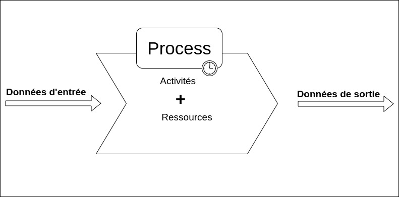
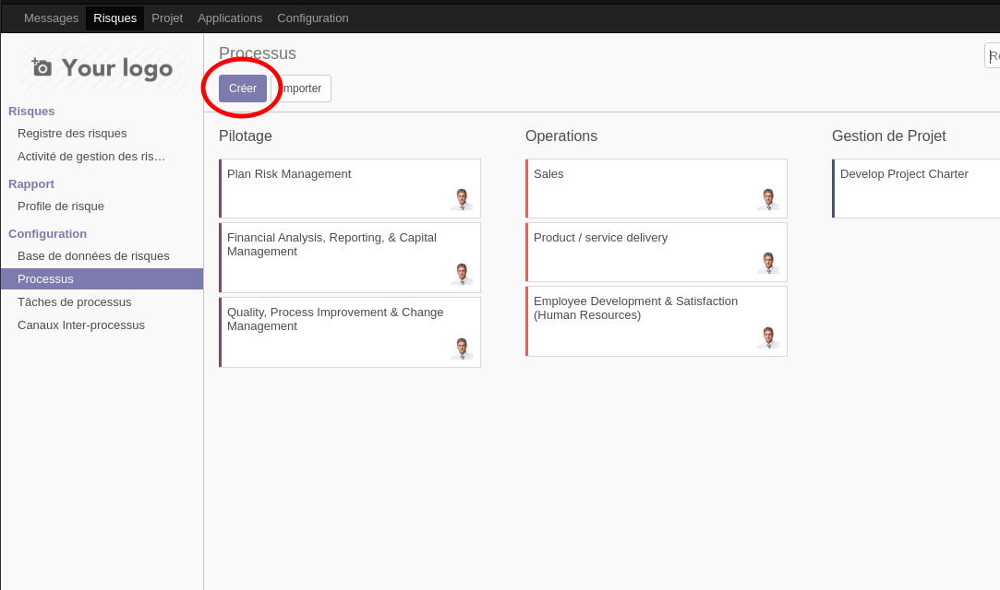
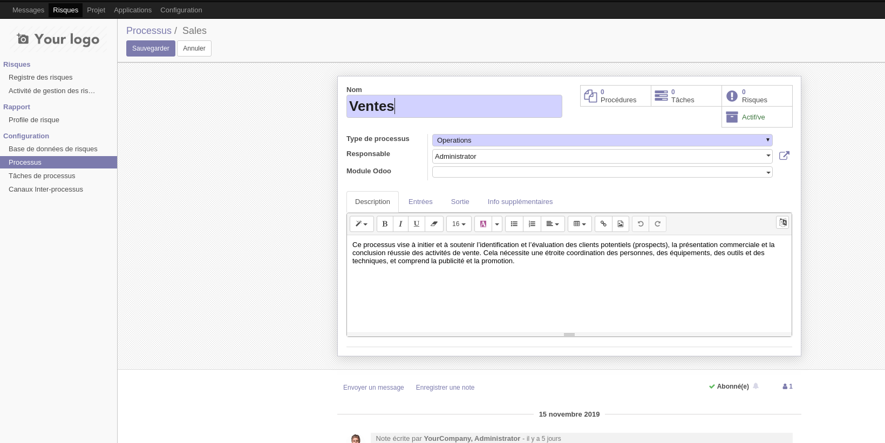
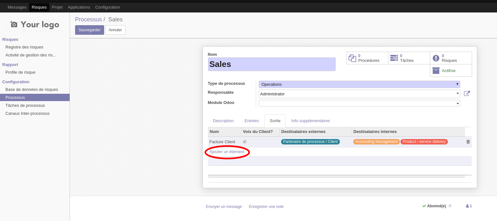
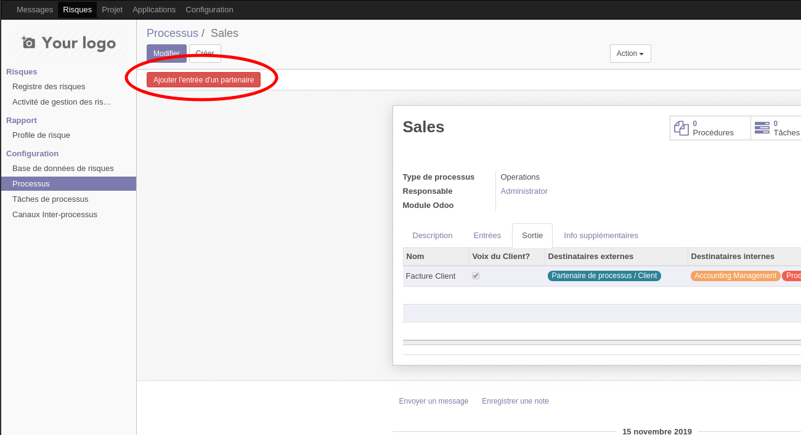
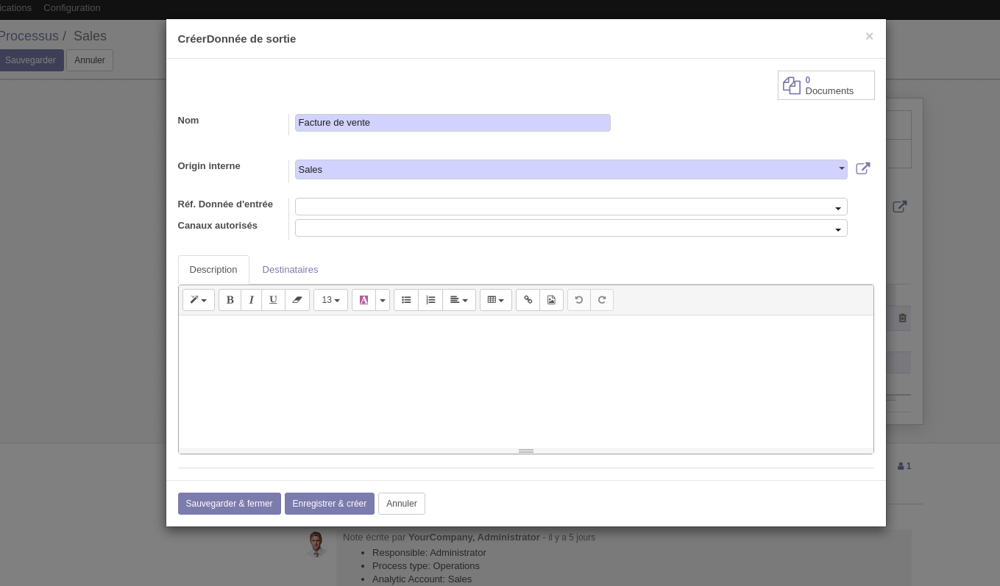

.. _user_documentation:

=====================================================
Documentation Utilisateur du Module `Risk Management`
=====================================================

Introduction
============

Le module `Risk Management` est un module **Odoo** conçu pour faciliter la gestion des risques au sein de l'entreprise. Il permet d'enregistrer les risques et de suivre l'évaluation et, eventuellement, le traitement de ceux-ci.

L'approche de la gestion du risque adoptée dans la conception du module `Risk Management` va dans le sens de la norme ISO 9001:2015 qui voit la gestion du risque "comme un outil de l'amélioration continue". Pour se faire la gestion des risques se base par défaut sur une cartographie des processus de l'entreprise; ceci donne la possibilité de rattacher chaque risque à un de ces  processus.

Fonctionnalités de l'application
================================
Les fonctionnalités du module `Risk Management` peuvent être regroupées sous 2 catégories:

#. La première et principale catégorie, celle de la gestion des risques, comprend les fonctionnalités suivantes:
    - l'enregistrement des risques signalés par les utilisateurs (en principes les employés de l'entreprise);
    - la notation des risques sur les critères de "détectabilité", de "probabilité d'occurrence" et de "sévérite";
    - le classement des risques par ordre de priorité, c'est à dire en fonction des scores de leur évaluation;
    - suivre les activités de traitement des risques.
#. La seconde catégorie, celle de la modélisation des processus, est subsidiaire et implémente de façon simplifiée l'`approche processus`. Elle comprend les fonctionnalités suivantes:
    - décrire les processus de l'entreprise ainsi que leurs interfaces;
    - définir les méthodes et les ressources des processus;
    - modifier les éléments précédents en réponse aux risques.

Étant donné que l'amélioration des processus est la *raison d'être* de la gestion des risque, nous commencerons par présenter les fonctionnalités de modélisation des processus.

La modélisation des Processus
-----------------------------

Le module `Risk Management` n'implémente pas une solution complète de **modélisation des processus metiers**, et, d'une façon générale, la fonctionnalité de modélisation des processus ne se conforme à aucune des méthodes courantes de modélisations des processsus telles que `BPMP (Business Process Model and Notation) <https://www.omg.org/bpmn/>`_ ou `EPC (Event-driven process chain) <https://fr.wikipedia.org/wiki/Chaines_de_processus_%C3%A9v%C3%A9nementielles>`_. De plus, cette fonctionnalité ne permet pas, du moins pour le moment, une représentation graphique du modèle des processus.

La fonctionnalité de modélisation des processus est présente pour servir de fil conducteur et de point d'ancrage pour les parties prenantes au processsus de gestion des risques. En effet chaque risque identifié peut être rattaché à un processus, et donc est accessible à partir de ce processus. De plus les risques peuvent être ajoutés à partir des processus. Par ailleurs la fonctionnalité de modélisation de processus permet de regrouper en un seul point pour être consultés par les utilisateurs:

- les processus,
- les interfaces entre les processus,
- les procédures et les méthodes des processus et enfin
- les tâches de processus

Les Processus
#############
Suivant la définition classique, un processus est un ensemble constitué d'activités et de ressources qui consomme des données d'entrée et produit des données de sortie.

    Un processus

L’*approche processus* est une approche systémique. Cela veut dire, entre autres, qu’il y aura plusieurs niveaux d’analyse. L'entreprise est un processus qui comprends d'autre processus qui constituent ses sous-processus (marketing, commercial, logistique entrant). Ces derniers peuvent être à leur tour divisés en de processus plus spécifiques encore, la finesse d'analyse étant dictée par des facteurs tels que la taille de l'entreprise.

Le découpage de l'entreprise en processus se base souvent sur le découpage fonctionnel existant.

Créer un processus
********************
Après avoir ouvert l'application en cliquant sur `Risques` dans la barre des menus d'**Odoo**, l'utilisateur peut acceder à la liste des processus en allant dans le volet des menus à gauche et en cliquant sur le lien *processus* sous le groupe *Configuration*. L'image ci-dessous montre une capture d'ecran d'une vue *kanban* de la liste des processus. Pour créer un processus, cliquer sur le bouton "Créer" entouré sur la capture.

    Liste Kanban des processus

Un processus est caractérisé par:

- un **nom**,
- une **description** qui indique la finalité du processus,
- le **responsable du processus**, qui répond des engagements du processus,
- des **entrées**,
- des **sorties**,
- les **activités** qui transforment les entrées en sorties en apportant une valeur ajoutée;
- Les **procédures et méthodes** définissant les contraintes et les règles d'exécution du processus;
- le **personnel du processus**, constitué du responsable du processus et des propriétaires des activités du processus;
- la **visibilité du processus**: privée (seul le personnel du processus y a accès) ou publique (les membres des autres processus y ont accès).

La figure ci-dessous montre un formulaire de creation de processus.

    Formulaire de processus

Les données d'entrée et de sortie des processus
###############################################
Les données d'entrée et de sortie des processus prennent la formes de message *non-persistants* (c'est à dire que leurs état peut toujours être modifié, même longtemps après leur creation, par exemple pour y ajouter de nouveaux destinataires) entre les processus, ou entre les processus et des catégories de partenaires externes de l'entreprise. Ces messages représentent aussi bien des informations tels que des factures ou des rapports, que des services et même des bien materiels transitant entre deux processus ou entre un processus et des partenaires externes.  Par exemple, une bon de commande client est une donnée d'entrée dont l'origine est la catégorie de partenaire *clients* et le destinataire un processus de l'entreprise (processus commercial dans le cas ou c'est celui-ci qui est chargé de traité les commandes clients); comme autre exemple de donnée on peut citer la facture de vente dont l'origine peut être le processus de vente et les destinataires le processus comptabilité et la categorie de partenaire *clients*.

Les données de sorties sont le resultats des contrats d'interface, c'est à dire qu'une donnée a un fournisseur (un processus) d'une part et un client d'autre part(un processus ou une categorie de partenaire); le contrat d'interface lie le fournisseur et le client et établit les conditions dans lesquelles le premier produira la sortie pour le second. Pour cette raison les données de sorties des processus sont crées au niveau de ceux-ci, mais pas les données d'entrée. Les destinataires des données de sortie, c'est à dire ceux pour qui celles-ci constituent des données d'entrée, sont ajoutés dans les champs destinataires des ces données.

Cependant les entrées de processus dont l'origine est exterieur à l'entreprise (comme par exemple les commandes clients) sont créées au niveau de l'un des processus à qui elles sont destinées.

    Certaines données représentent la *voix du consommateur*. Une commande client par exemple représente la *voix du consommateur*. Les processus qui traitent les données *voix du consommateur* deviennent des processus clés pour l'entreprise.

Créer une sortie de processus
******************************
Pour ajouter une sortie à un processus, aller dans l'onglet "Sorties" du formulaire du processus en mode création et cliquer sur le lien qui se trouve *ajouter un element*, tel que visible sur la figure ci-dessous.

    Créer une sortie

Le bouton `Ajouter l'entrée d'un partenaire`, situé en haut du formulaire à droite sert à ajouter des données d'entrée venant de l'exterieur de l'entreprise.

    Créer une entrée

Une sortie de processus est caractérisée par:

- un **nom**; exemple: *Facture client*, *Bon de commande*;
- une **description**, qui donne un aperçu du contenu de la sortie;
- une **origine**; elle est soit externe lorsqu'elle vient d'une catégorie de partenaire, soit interne lorsqu'elle vient d'un autre processus;
- une **'entrée qu'elle référence**; une sortie d'un processus peut référencer une entrée de ce même processus. Par exemple, une facture client peut référencer un bon de commande client. Ceci permet entre autre de suivre la voix du client à travers les opérations de l'entreprise.
- des **canaux autorisés**; les données de sorties sont transmis à leurs destinataires à travers des canaux prédéfinis: ce peut être par email, par téléphone;
- des **destinataires**: destinataires internes et/ou destinataires externes.
- des **pièces jointes** pour apporter des précisions sur le contenu de la sortie; exemple: un modèle de facture;

Le formulaire de creation des entrées est le même que celui des sorties, ls seules différences au moment de son invocation étant le champs de l'origine ainsi que l'origine par défaut sélectionnée.

la figure ci-après présente un aperçu du formulaire de creation d'une sortie.

    Formulaire des données de sortie.

Les activités
#############

